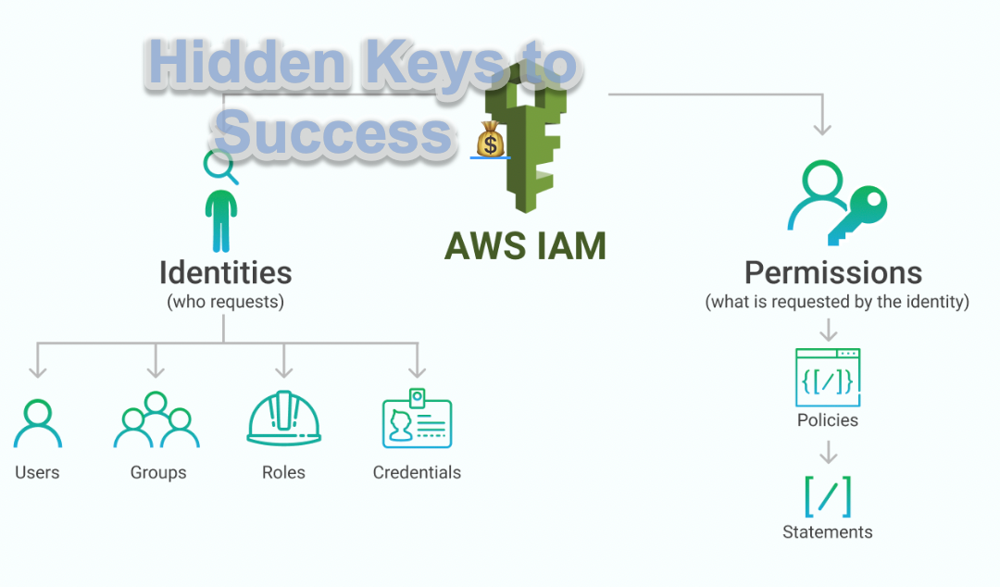

AWS Identity and Access Management (IAM) is a web service that helps you securely control access to AWS resources for your users. You can specify permissions to a single user or you can use groups to specify permissions for a collection of users, which can make those permissions easier to manage for those users. Furthermore, you can use a Role to grant authorization to AWS resources without any credentials (password or access keys) directly associated with it. In this lab, you will learn the recommended AWS security best practices.
### Video Explanation:

IAM (Identity and Access Management) policies are a crucial aspect of security in AWS. IAM policies define who can access what resources within an AWS account, and what actions they can perform. In this article, we'll dive into the basics of IAM policies and how to create and manage them in AWS.

IAM policies are written in JSON and are made up of a set of statements that specify the permissions granted to a user or group. Each statement includes an action, such as "s3:GetObject" and a resource, such as "arn:aws:s3:::bucket-name/*".

When a user attempts to access a resource in AWS, the AWS API checks the IAM policies associated with the user to determine whether the requested action is allowed. If the action is allowed, the request is processed, and if not, the request is denied.

IAM policies can be created and managed in the AWS Management Console, through the AWS CLI, or via APIs. In the AWS Management Console, policies can be created using the policy generator, which provides a visual interface for building policies. You can also create policies from scratch in JSON or copy and paste existing policies.

AWS also provides several managed policies that can be attached directly to users or groups, rather than creating custom policies. These policies grant pre-defined permissions for common use cases, such as allowing a user to manage Amazon S3 buckets.

It's important to keep in mind that IAM policies are a critical component of AWS security, so it's essential to be mindful of the permissions granted to users and regularly review and update policies as needed.

In conclusion, IAM policies in AWS allow you to control access to resources within your AWS account and secure your data. With the ability to create custom policies or attach managed policies, you can easily manage the permissions of your users. Ensure to keep your policies up-to-date and take advantage of the security features provided by AWS.

### Make 💰 By Learning Programming:
- [Tesla](https://ts.la/khaled835973)
- [Liquid I.V. Hydration Multiplier 30 Stick, 16.93 Ounce](https://amzn.to/3ZFDjDq)
- [Xeela Pre workout]()
- [Sour Strips](https://amzn.to/3EDWUM7)

- [Impractical Python Projects](https://amzn.to/3JpCpWH)
- [Designing Data-Intensive Applications](https://amzn.to/3Hgh5Sj)
- [Python for Data Analysis](https://amzn.to/3D0C8pl)
- [Python for Data Science Handbook](https://amzn.to/3XnZ1ez)
- [Hands-On Machine Learning w/Scikit-Learn & Tensorflow](https://amzn.to/3QTWoyt)

 